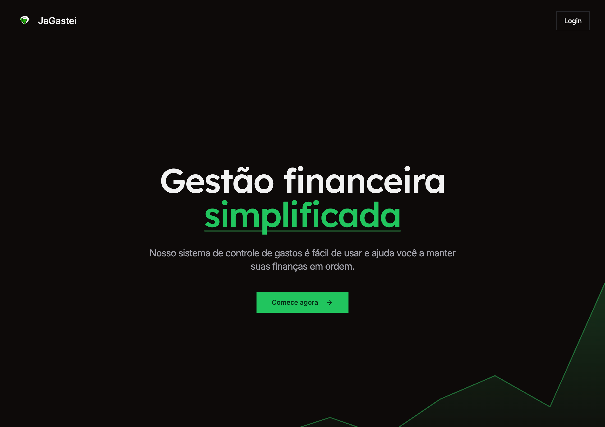
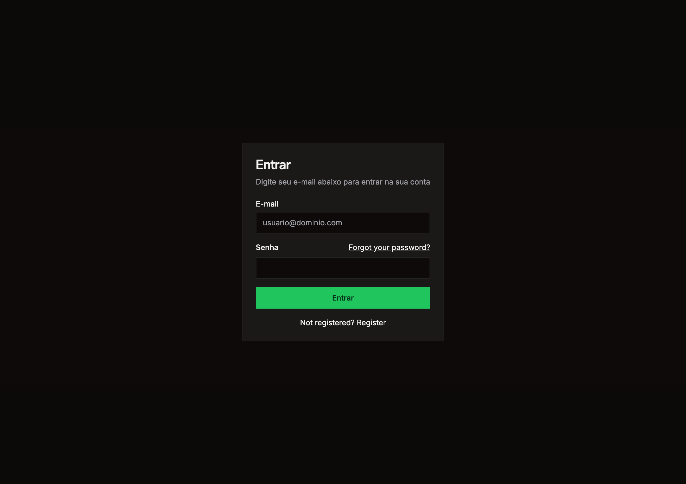
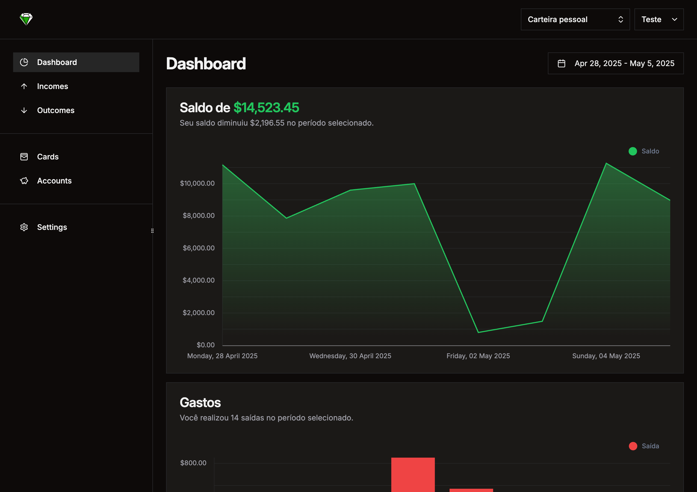
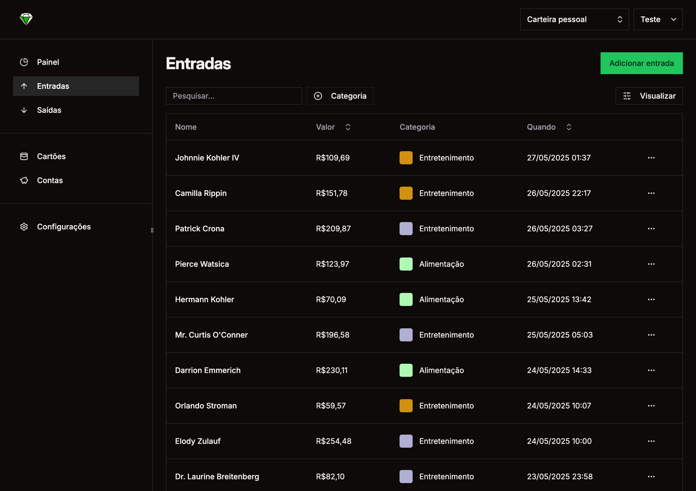

# WIP

JaGastei is a personal work in progress project

## About the project

JaGastei is a platform for managing personal finances.  
JaGastei is a personal project that I am using to learn new technologies such as:

- [Event-sourcing](https://verbs.thunk.dev/).
- [Internationalization](https://www.i18next.com/).
- [Whatsapp integration](https://github.com/EvolutionAPI/evolution-api)
- [Shadcn-vue](https://www.shadcn-vue.com/examples/mail)
- [Posthog](https://posthog.com/)
- [Monitoring and observability](https://betterstack.com/)
- [Typesense](https://typesense.org/)
- Usage of AI for reading images and summarization

## Screenshots

